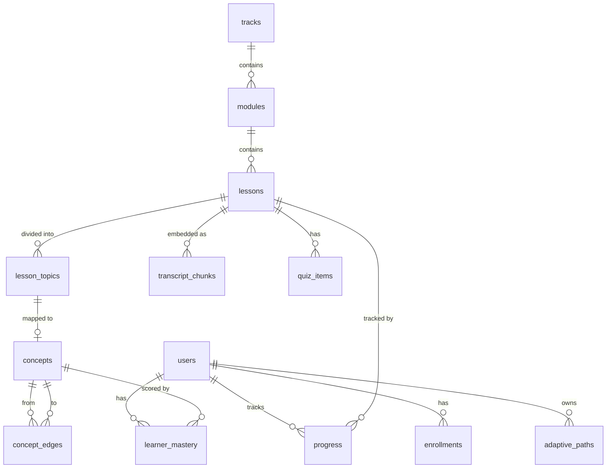

# Fixeth — Architecture Blueprint
**Version:** 2.0 — Final Round
**For:** THE INFINITY AI BUILDFEST 2026 — EdTech Track
**Companion to:** `docs/PRD.md`, `docs/DATA_STRATEGY.md`, `docs/SCALABILITY_ROADMAP.md`, `docs/ETHICS.md`

---

## 1. System Overview

Fixeth is a four-layer AI-native system: a user interaction layer (Next.js), an application logic layer (Next.js API routes + Supabase Edge Functions), an AI intelligence layer (Claude / Gemini / BYOA with topic-anchored RAG), and a knowledge retrieval layer (pgvector + PostgreSQL graph + admin-managed config in Supabase Storage).

```
┌──────────────────────────────────────────────────────────────────┐
│  1. USER INTERACTION LAYER                                       │
│  Next.js 14 (App Router) · TypeScript · Tailwind · shadcn/ui     │
│  Mobile-first · Dark/Light · Bengali/English · Low-bandwidth     │
│                                                                  │
│  Public:   Landing · Pricing · About · Docs (markdown)           │
│  Onboard:  Language → Goal → Level → Track → Diagnostic          │
│  Auth:     /login · /signup · /auth/callback (Supabase OAuth)    │
│  App:      Dashboard · Track Library · My Tracks ·               │
│            Guided Video · Quiz · Submissions · Notebook ·        │
│            Code Space · Tools · AI Mentor · Profile Settings     │
│  Admin:    /admin (docs editor + API key rotation + audit log)   │
└──────────────────────────────────────────────────────────────────┘
                              │
                              ▼
┌──────────────────────────────────────────────────────────────────┐
│  2. APPLICATION LOGIC LAYER                                      │
│  Next.js API Routes (`app/api/*`)                                │
│  Supabase Edge Functions (for cron-style jobs post-launch)       │
│                                                                  │
│  /api/chat           — AI tutor with topic-anchored RAG          │
│  /api/profile/*      — User prefs, NRB mode, theme, language     │
│  /api/admin/*        — Docs editor, API key rotation, audit      │
│  /api/progress       — Lesson completion, streak, mastery update │
│  /api/enroll         — Track enrollment, current_lesson update   │
│  /api/subtitle       — Subtitle overlay fetch (per lesson)       │
│  /api/diagnostic     — Onboarding diagnostic scoring             │
│  /api/adaptive-path  — Concept graph traversal + path build      │
│  /api/assessment     — Rubric-based submission grading            │
└──────────────────────────────────────────────────────────────────┘
                              │
                              ▼
┌──────────────────────────────────────────────────────────────────┐
│  3. AI INTELLIGENCE LAYER                                        │
│                                                                  │
│  PLATFORM-SHARED (admin-managed rotating key):                   │
│  • Primary: Gemini 2.0 Flash (free tier, multilingual)           │
│  • Fallback slot 1: configurable from /admin                     │
│  • Retry-once on rate-limit; soft-fail to user on persistent fail│
│  • Key stored in `admin_config` table, never exposed to client   │
│                                                                  │
│  BYOA (Bring Your Own API — user-pasted keys):                   │
│  • OpenAI · Anthropic · Gemini · Groq · Ollama (local)           │
│  • Key in `localStorage` only, never to server                   │
│  • Auto-detected on profile settings save                        │
│                                                                  │
│  PROMPT PATTERNS:                                                │
│  • RAG-grounded generation (retrieved chunks in system prompt)   │
│  • Topic-anchored citation (every answer must include [ts:MM:SS])│
│  • Multi-level explanations (ELI5 / Student / Practitioner)      │
│  • Rubric-based assessment (structured JSON output)              │
│  • Bengali glossary enforcement (technical terms in English)     │
└──────────────────────────────────────────────────────────────────┘
                              │
                              ▼
┌──────────────────────────────────────────────────────────────────┐
│  4. KNOWLEDGE RETRIEVAL LAYER                                    │
│                                                                  │
│  pgvector (Supabase extension)                                   │
│  • `transcript_chunks` — 768-dim embeddings (Ollama nomic)      │
│  • Cosine similarity search via `match_transcript_chunks` RPC    │
│  • Topic-anchored retrieval (chunks grouped by `lesson_topics`)  │
│                                                                  │
│  PostgreSQL Graph Tables                                        │
│  • `concepts` — concept nodes (mapped from lesson_topics)        │
│  • `concept_edges` — `requires` / `reinforces` edges             │
│  • `learner_mastery` — per-user concept scores                   │
│  • Recursive CTE traversal in `get_concept_path` RPC             │
│                                                                  │
│  Supabase Storage                                                │
│  • `admin_config` (via table) — API keys, feature flags          │
│  • `docs_content` (via table) — /docs markdown                   │
│  • `audio/` — Whisper source audio (post-processing)             │
│  • `vtt/` — generated subtitle files (post-launch)              │
│  • `certificates/` — generated PDFs (post-launch)                │
└──────────────────────────────────────────────────────────────────┘
                              │
                              ▼
┌──────────────────────────────────────────────────────────────────┐
│  5. AGENT ORCHESTRATION LAYER (`lib/agents/`)                    │
│  MCP-style contracts, in-repo implementation                     │
│                                                                  │
│  Curriculum Agent  — `lib/agents/curriculum.ts`                  │
│    Input:  user_id, track_id, mastery_state, trigger             │
│    Output: ordered lesson path with skip + remedial injection    │
│    Used by: onboarding completion, quiz result, module complete  │
│                                                                  │
│  Tutor Agent       — `lib/agents/tutor.ts`                       │
│    Input:  question, lesson_id, current_ts, language             │
│    Output: grounded answer + clickable timestamp + sources      │
│    Used by: Guided Video "Chat with video" tab                   │
│                                                                  │
│  Assessment Agent  — `lib/agents/assessment.ts`                  │
│    Input:  submission, rubric, concept_ids                      │
│    Output: per-criterion scores + feedback (EN + বাংলা)          │
│    Used by: submissions, capstone grading                        │
└──────────────────────────────────────────────────────────────────┘
```

---

## 2. Data Flow per Feature

### 2.1 Video Timestamp-Seek (Hero Feature)

```
User types question in chat
  │
  ▼
POST /api/chat { question, lesson_id, language }
  │
  ▼
1. Resolve active API key
   • if user has BYOA key in localStorage → use it (client-side call)
   • else → read admin_config.active_api_key → server-side Gemini call
  │
  ▼
2. Topic-anchored retrieval
   • SELECT * FROM lesson_topics WHERE lesson_id = ? ORDER BY order_index
   • For each topic, gather transcript_chunks where start_time BETWEEN topic.start_time AND topic.end_time
   • Build a "topic representation" string per topic
  │
  ▼
3. Embed question
   • POST to Ollama nomic-embed-text → 768-dim vector
  │
  ▼
4. Cosine similarity search
   • pgvector: SELECT topic_rep, similarity FROM topic_reps ORDER BY similarity DESC LIMIT 3
   • Filter: similarity >= 0.7
  │
  ▼
5. Build LLM prompt
   • System: "You are Fixeth's in-video tutor. Use ONLY these topics to answer.
              Cite by [ts:MM:SS]. Respond in <language>."
   • User: question + retrieved topic representations
  │
  ▼
6. Call LLM (Gemini Flash or BYOA)
   • With retry-once on rate-limit
   • Soft-fail on persistent error
  │
  ▼
7. Parse response
   • Extract [ts:MM:SS] markers
   • Return JSON: { answer, language, sources, action: "seek_video" }
  │
  ▼
Client renders answer with clickable timestamp
  │
  ▼
User clicks timestamp → YouTube player.seekTo(seconds)
```

### 2.2 NRB Mode Activation

```
User toggles "NRB mode" in profile settings
  │
  ▼
PATCH /api/profile { nrb_mode: true, country_code: "HU" }
  │
  ▼
UPDATE users SET nrb_mode = true, country_code = 'HU' WHERE id = ?
  │
  ▼
Re-render dashboard
  │
  ▼
Dashboard component checks users.nrb_mode
  │
  ▼
If TRUE: query lesson_topics WHERE nrb_relevant = true ORDER BY created_at LIMIT 5
  │
  ▼
Render "From abroad" card with those lessons
```

### 2.3 Admin API Key Rotation

```
Admin opens /admin
  │
  ▼
Auth check: users.role = 'platform_admin' (in layout)
  │
  ▼
Tab: "API Keys"
  │
  ▼
Render 4 fields, each showing:
  • field number
  • current value (masked: "sk-...xyz")
  • status: "active" / "limit_used" / "empty"
  │
  ▼
Admin pastes new key in empty field → click "Save"
  │
  ▼
PATCH /api/admin/keys { slot: 3, value: "sk-..." }
  │
  ▼
UPDATE admin_config SET value = '{"slot": 3, "status": "empty", "key": "sk-..."}' WHERE key = 'api_keys'
  INSERT INTO admin_audit (action, details, actor) VALUES ('key_saved', {slot: 3}, admin_email)
  │
  ▼
Admin clicks "Mark limit used" on slot 1
  │
  ▼
PATCH /api/admin/keys { slot: 1, status: "limit_used" }
  │
  ▼
Server auto-marks next "empty" slot as "active"
  │
  ▼
Subsequent /api/chat calls use the new active key
```

### 2.4 Onboarding → Adaptive Path

```
User completes 5-step onboarding
  │
  ▼
POST /api/onboarding/complete { goal, experience_level, track_id, diagnostic_scores }
  │
  ▼
UPDATE users SET goal = ?, experience_level = ?, onboarding_complete = true
INSERT INTO enrollments (user_id, track_id, current_lesson_id) VALUES (?, ?, first_lesson)
  │
  ▼
Background: call Curriculum Agent
  │
  ▼
SELECT c.*, COALESCE(lm.score, 0) as mastery
FROM concepts c
LEFT JOIN learner_mastery lm ON c.id = lm.concept_id AND lm.user_id = ?
WHERE c.track_id = ?
ORDER BY c.difficulty, c.id
  │
  ▼
Build ordered path:
  • mastery >= 80 → skip with reason "Already mastered"
  • mastery < 60 and attempts > 0 → inject remedial micro-lesson
  • else → include normally
  │
  ▼
INSERT INTO adaptive_paths (user_id, track_id, path_json) VALUES (?, ?, ...)
  │
  ▼
Dashboard reads adaptive_paths and renders "Your path" with skip indicators
```

---

## 3. Database Schema (v2.0)

Existing tables (from prior migrations): see `supabase/migrations/20260527_init_schema.sql` through `20260602_notebooks_and_publish.sql`.

**New in v2.0:** `lesson_topics`, `admin_config`, `admin_audit`, `docs_content`. See `supabase/migrations/20260610_plan2_schema.sql` for full DDL.



---

## 4. API Contracts

All API routes follow the shape: `{ data, error }` per `AGENTS.md` conventions. Zod-validated inputs.

### 4.1 POST /api/chat

```ts
// Request
{
  question: string,           // 1-500 chars
  lesson_id: string,          // UUID
  language: "en" | "bn",
  use_byoa?: boolean          // default: false (use platform key)
}

// Response
{
  data: {
    answer: string,           // markdown, may contain [ts:MM:SS] markers
    language: "en" | "bn",
    sources: [{
      topic_id: string,
      topic_label: string,
      start_time: number,
      end_time: number,
      similarity: number
    }],
    action: "seek_video" | "show_in_practice_tab" | null
  },
  error: null | { code: string, message: string }
}
```

### 4.2 PATCH /api/profile

```ts
// Request
{
  preferred_language?: "en" | "bn",
  preferred_theme?: "dark" | "light",
  nrb_mode?: boolean,
  country_code?: string,
  goal?: "job" | "upskill" | "switch" | "explore",
  experience_level?: "beginner" | "some" | "pro"
}

// Response
{ data: { user: User }, error: null | { code, message } }
```

### 4.3 PATCH /api/admin/keys

```ts
// Request
{
  slot: 1 | 2 | 3 | 4,
  value?: string,             // the new key (omit to keep current)
  status?: "active" | "limit_used" | "empty"
}

// Response
{ data: { keys: ApiKey[] }, error: null | { code, message } }
```

### 4.4 PUT /api/admin/docs/[slug]

```ts
// Request
{
  title: string,
  content_md: string,
  published?: boolean
}

// Response
{ data: { doc: DocContent }, error: null | { code, message } }
```

### 4.5 GET /api/adaptive-path

```ts
// Query params
?user_id=<uuid>&track_id=<uuid>

// Response
{
  data: {
    path: [{
      lesson_id: string,
      skip: boolean,
      reason?: string,
      injected_remedial?: string
    }],
    skipped_count: number,
    message: string
  },
  error: null | { code, message }
}
```

---

## 5. Agent Contracts (lib/agents/)

### 5.1 Curriculum Agent — `lib/agents/curriculum.ts`

**Input:**
```ts
{
  user_id: string,
  track_id: string,
  mastery_state: { [concept_id: string]: number },  // 0-100
  trigger: "enrollment" | "quiz_result" | "module_complete" | "cross_track"
}
```

**Process:**
1. Recursive CTE traversal of `concept_edges` (topological sort, DAG)
2. For each concept: score >= 80 → skip; score < 60 + attempts > 0 → inject remedial; else include
3. Cross-track: diff new track's nodes against `learner_mastery`
4. Store ordered path in `adaptive_paths`
5. Sub-functions: pacing (session gaps), difficulty calibrator (streaks)

**Output:**
```ts
{
  path: Array<{
    lesson_id: string,
    skip: boolean,
    reason?: string,
    injected_remedial?: string  // lesson_id
  }>,
  skipped_count: number,
  message: string  // shown to learner, in user's language
}
```

**Status:** Implemented as v1. Recursive CTE + concept graph traversal working for the 5 published tracks. Sub-functions (pacing, difficulty calibrator) are stubs for v2.1.

### 5.2 Tutor Agent — `lib/agents/tutor.ts`

**Input:**
```ts
{
  question: string,
  lesson_id: string,
  video_id: string,
  current_timestamp_sec: number,
  language: "en" | "bn"
}
```

**Process:**
1. Topic-anchored retrieval (see §2.1)
2. Embed question → pgvector cosine search (top 3, threshold 0.7)
3. If no topic ≥ 0.7 → "I couldn't find this in the video"
4. Else: ground LLM response in retrieved context, enforce `[ts:MM:SS]` citation
5. Return seek_to_seconds mapped to best matching topic

**Output:**
```ts
{
  answer: string,
  language: "en" | "bn",
  timestamp: { seek_to_seconds: number, label: string } | null,
  action: "seek_video" | "show_in_practice_tab" | null,
  source_chunks: Array<{ chunk_id: string, similarity: number }>
}
```

**Status:** Implemented as v1. Topic-anchored retrieval + Gemini Flash integration + retry-once + soft-fail all working. Manual topic entry for the 5 hero videos is in progress.

### 5.3 Assessment Agent — `lib/agents/assessment.ts`

**Input:**
```ts
{
  submission_content: string,
  rubric: Array<{ criterion: string, weight: number, description: string }>,
  concept_ids: string[]
}
```

**Process:**
1. LLM evaluation: submission vs each rubric criterion
2. Per-criterion score (0 to weight)
3. Constructive feedback paragraph (200 words max)
4. Bengali feedback if `user.language === 'bn'`
5. Plagiarism pre-check: cosine sim vs other submissions (post-launch)

**Output:**
```ts
{
  scores: { [criterion_name: number]: number },
  total: number,
  max: number,
  feedback: string,
  feedback_bn: string | null,
  pass: boolean,
  per_criterion_notes: Array<{ criterion: string, score: number, note: string }>
}
```

**Status:** Implemented as v1. Rubric-based grading working with Gemini Flash. Bengali feedback working. Plagiarism check is stubbed (returns 0.0) for v1.

---

## 6. Environment Configuration

```env
# Supabase (single DB, source of truth)
NEXT_PUBLIC_SUPABASE_URL=https://oxfynuytsnifqqhbmpcv.supabase.co
NEXT_PUBLIC_SUPABASE_ANON_KEY=<anon>
SUPABASE_SERVICE_ROLE_KEY=<service-role>  # server only, never client

# Vercel
NEXT_PUBLIC_APP_URL=https://fixeth.vercel.app
VERCEL_ENV=production

# AI (admin-managed at runtime, no env-var dependency post-deploy)
# Keys live in admin_config table, rotated from /admin page

# Admin
FIXETH_ADMIN_EMAILS=admin@fixeth.ai,shafin@fixeth.ai

# Optional: default BYOA hints (user overrides)
NEXT_PUBLIC_DEFAULT_BYOA_PROVIDER=gemini
```

**No API keys in env vars post-deploy.** All AI keys are admin-managed via `/admin` and stored in `admin_config` table. This is the entire point of the admin page — avoid re-deployments for key rotations.

---

## 7. Scalability Characteristics

| Dimension | Current | At 10K users | At 100K users |
|---|---|---|---|
| Auth | Supabase Auth (managed) | Same | Same |
| DB | Supabase Free tier | Supabase Pro | Supabase Pro + read replica |
| AI calls | Free tier Gemini | Negotiate higher rate limit | Paid tier + BYOA hybrid |
| Hosting | Vercel Hobby | Vercel Pro | Vercel Pro + edge functions |
| Storage | Supabase Storage (default) | Supabase Storage | Cloudflare R2 for media |
| Vector search | pgvector + ivfflat | Same + tuned `lists` | pgvector + partitioning by track |

**Bottleneck predictions:**
- 1: AI rate limits (mitigated by retry-once + soft-fail + BYOA)
- 2: pgvector index at >1M chunks (mitigated by partitioning by `track_id`)
- 3: Cold starts on Vercel (mitigated by edge functions for `/api/chat`)

See `docs/SCALABILITY_ROADMAP.md` for the full scaling plan.

---

## 8. NRB Collaboration Notes

Our team includes a university lecturer from Hungary (non-resident Bangladeshi). Their contribution to v2.0:

- International standards review of the certificate format and public profile.
- Validation that NRB content covers the most common cross-border life situations (validated against a small survey of BD diaspora students in EU universities).
- Cross-cultural UX feedback on the NRB mode copy (English-Bengali mix patterns common in diaspora communities).
- Reviewer of the financial literacy content (cross-border payments section).

This is documented in the team page (`app/(public)/about/page.tsx`) and the team members migration (`supabase/migrations/20260531_update_team_members.sql`).

---

## 9. Module Boundaries (what talks to what)

| From | To | Mechanism | RLS enforced? |
|---|---|---|---|
| Client component | Supabase | `lib/supabase/client.ts` | Yes (auth.uid()) |
| Server component | Supabase | `lib/supabase/server.ts` | Yes |
| API route | Supabase | `lib/supabase/server.ts` | Yes |
| API route | LLM provider | Direct HTTPS call with key from `admin_config` | N/A |
| Client | LLM provider | Direct HTTPS call with BYOA key in `localStorage` | N/A |
| API route | Ollama | Direct HTTPS to local Ollama (dev only) | N/A |
| Background job | Supabase | Edge Function with service role | No (server-side trust) |
| Admin page | API route | `users.role = 'platform_admin'` check in layout | Yes |

**No cross-layer coupling.** Each layer has a single ingress point. Replacing any one layer (e.g. swap Gemini for Claude) requires changes in exactly one file.

---

## 10. Failure Modes & Degradation

| Failure | User-visible behavior | Engineering mitigation |
|---|---|---|
| Supabase down | "We're having trouble. Please try again." | Retry in client; show offline message |
| Gemini rate-limited | Retry once with secondary key; if still failing, soft-fail | Soft-fail message in user's language |
| Gemini key invalid (all 4 slots) | "AI features temporarily unavailable. Use BYOA in settings." | Admin rotates key in `/admin` |
| BYOA key invalid | "Your API key was rejected. Check it in profile settings." | Show error verbatim |
| YouTube video unavailable | "Video temporarily unavailable. Try another lesson." | Skip and continue |
| Subtitle file missing | Subtitle toggle hidden | Graceful UI degradation |
| Topic boundaries missing | "AI tutor is learning this video. Try again in a few minutes." | Build-time check, manual entry required |
| Mobile 2G detected | (post-launch) Text-only mode | Hook in `lib/responsive.ts` reserved |

---

*Fixeth Architecture v2.0 — Last updated 2026-06-10*
